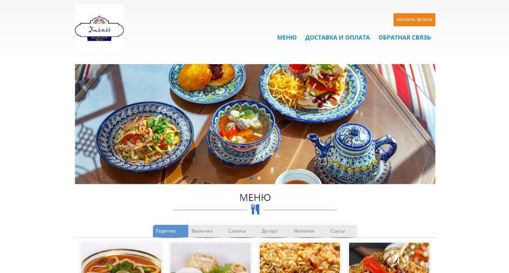
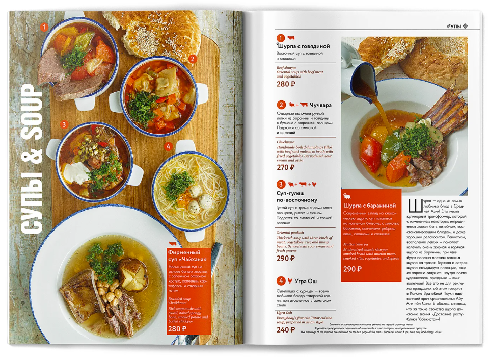

## О проекте

**Сайт для ресторана восточной кухни** — это полнофункциональный веб-проект, созданный для демонстрации возможностей современной фронтенд-разработки. Сайт включает:

- Главную страницу с приветствием и акционными предложениями.
- Меню с категориями (суши, роллы, воки, салаты, напитки) и возможностью фильтрации.
- Систему онлайн-бронирования столиков с выбором даты, времени и количества гостей.
- Галерею фотографий блюд и интерьера.
- Страницу контактов с картой проезда и формой обратной связи.

Проект полностью адаптивен и корректно отображается на всех устройствах: от настольных компьютеров до мобильных телефонов.

## Технологии

- **HTML5** — семантическая разметка.
- **CSS3** — кастомные стили, Flexbox, Grid, анимации.
- **JavaScript (ES6)** — динамическая подгрузка меню, валидация форм, работа с localStorage для корзины.
- **Bootstrap 5** — сетка и компоненты.
- **Font Awesome** — иконки.
- **Google Fonts** — шрифты.

В качестве бэкенда для отправки заявок использован сервис FormSubmit (имитация). Планируется интеграция с Node.js + Express в будущем.

## Скриншоты





## Как запустить локально

1. Клонируйте репозиторий:
   ```bash
   git clone https://github.com/Amina-colab/eastern-restaurant.git
   cd eastern-restaurant

2. Откройте файл index.html в любом браузере.
Никаких дополнительных зависимостей не требуется.

## Планы по развитию

- Добавить админ-панель для управления меню и бронями.

- Реализовать отправку уведомлений на email при новом бронировании.

- Подключить настоящий бэкенд на Python (Django) или Node.js.

- Оптимизировать производительность (Lazy Loading изображений, минификация CSS/JS).

## Вывод
Проект помог мне закрепить навыки вёрстки и клиентского JavaScript, а также научил организовывать структуру многостраничного сайта. В будущем планирую превратить его в полноценное веб-приложение с базой данных.